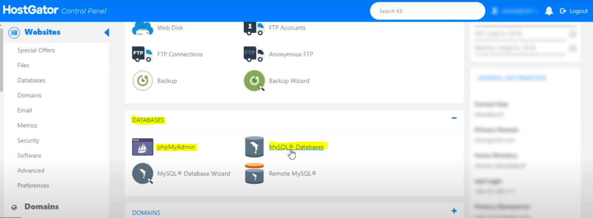
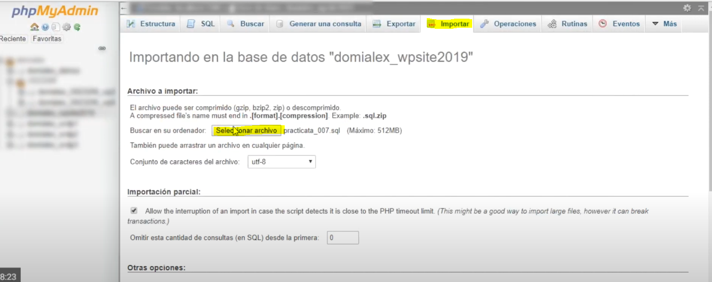
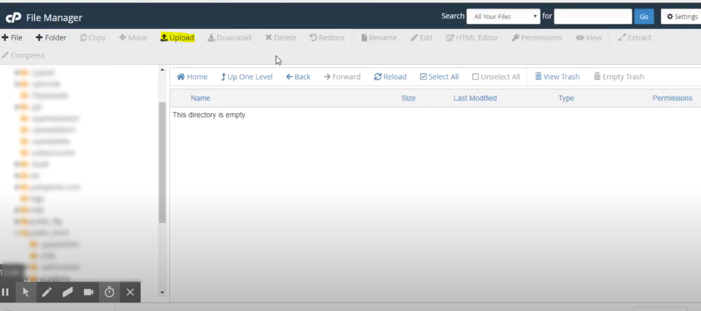
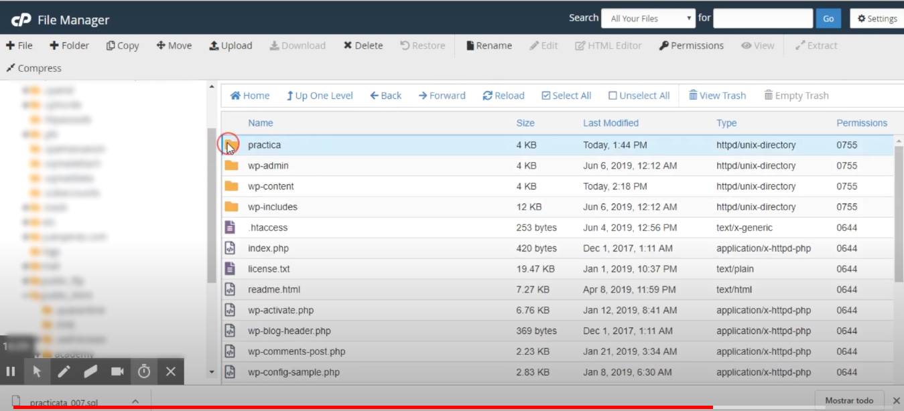
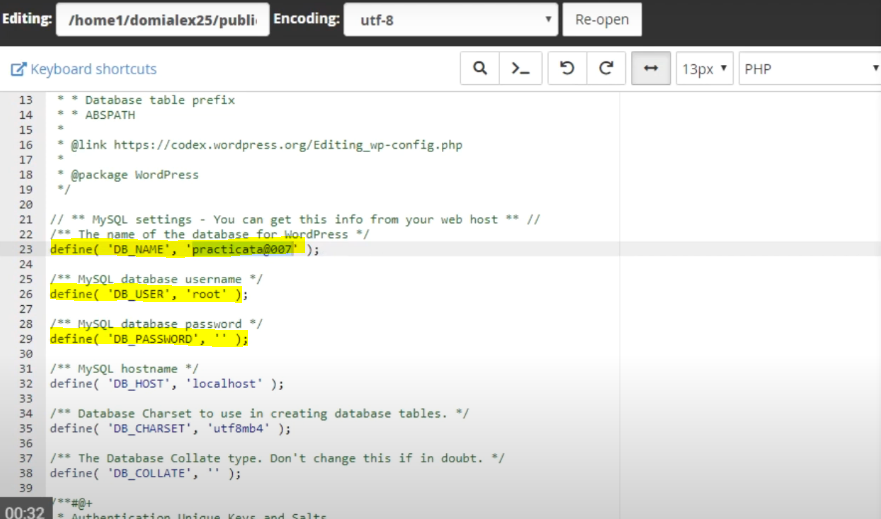
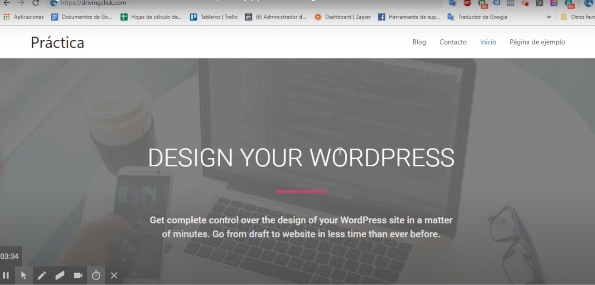

# Pasos para crear tu propio Wordpress.
##### (de forma local mediante software Xampp)
## Instalacion de Xampp
¿Que es Xampp?

Xampp es una distribucion de Apache, donde Apache es un servidor web gratuito y de codigo abierto que permite a los propietarios de sitios web servir contenido en la web.

Para Instalar el software, dirigirse al enlace : https://www.apachefriends.org/es/index.html
Y seguir los siguientes pasos con normalidad. 

(consejo: si este mensaje aparece al principio no preocuparse,ya que es solo tema de licencias).

Ya terminando la instalacion e inicio de Xampp, actiavr los puertos Apachey MySQL, minimizar al terminar.

## Instalacion Wordpress
¿Que es Wordpress?

Worpress es un sistema de gestion de contenido (CMS) que permite crear y mantener un blog u ptro tipo de sitios web.

Instalar el software por medio del enlace: 
https://es.wordpress.org/

 la carpeta de Wordpress descargada es un archivo zip por ende se necesita un programa que lea estos archivos (winrar).

 Nos dirigimos a la carpeta **htdocs** ubicada en el disco local (c:), en la carpeta de **Xampp**.

 

 Estando ya en la carpeta **htdocs** crear una carpeta y nombrarlo a su gusto (recomendacion: si quieren, pueden nombrar la carpeta como el proyecto que estan desarrollando para no lograr confusiones, como la base de datos y el sitio)

 LLevar el archivo Zip dentro de la carpeta creada y extraer todo en el lugar, le aparecera una carpeta de nombre **wordpress**, copiar todos los archivos de esa carpeta y pegarlos dentro de la carpeta que se creo y nombro.

 

(eliminar archivo zip y la carpeta **wordpress** que se extrajo)

## Creacion de Base de datos

Dentro de su navegador , escribir **local host** (tener en cuenta que Xampp tiene que estar activo (apache y MySQT))

Dirigirse a **phpmyadmin**,tambien entrar a la pestaña de **Bases de datos** y crear la base de datos necesaria (recomendacion: tal como se dijo anteriormente,se recomienda nombrar tambien la base de datos como el proyecto , tambien como sucedio con la carpeta , para que no suceda confusion al momento de ubicar la base de datos).

## Empezar con el sitio de wordpress

En el navegador escribir : 
**localhost/nombre-de-la-carpeta** (carpeta que creaste dentro de htdocs)

 te aparecera una pestaña de wordpress (primeros pasos para crear tu wordpress)

Clickear el boton para llevarlo a la seccion de rellenar todos los datos.

( notar que el nombre de usuario root y la contraseña e blanco es por defecto para trabajar en servidor local)

Mas adelante es solo colocar el nombre del sitio web, su nombre de usuarios, contraseña y un correo electronico para ya empezar a trabajar 

Despues de todos estos pasos estaralisto el sitio web para poder se trabajado a su antojo , con diferentes temas y colocar diferentes contenido.

## Lograr llevar tu pagina web local a un host online 

Primero confirmar de que el Xampp este activo con el Apache y MySQL prendidos.

tambien ir a la direccion : **localhost/phpmyadmin** y clickear exportar a la base de datos de nuestro proyecto, al archivo que se entrega guardarlo.

Ya con esto ir a la carpeta **htdocs** , dentro de la carpeta Xampp ubicada en el disco local C. Compimir la carpeta de el proyecto en formato .zip

Dirgirse a su hosting de pago, en su propio usuario , la mayoria de estos tienen una seccion denominada **Base de Datos** donde se encuentran secciones de **phpmyadmin** y **MySQL Databases**. ( para este ejemplo se mostrara el generador de host en Hostgator)

De esta manera empezamos con MySQL database para crear la base de datos , crear nombre de la base de datos , crear un usuario y contraseña para esto. 

en el siguiente paso se tiene que adjuntar el usuario y la base de datos que creo en el paso anterior 

( clickear con un ticket **all privilege** en la pagina al hacer su base de datos), despues de todo esto su base de datos se ha procesado, despues de esto ,ir al incio de su proveedor de host en el panel de control, dirigirse a **phpMyAdmin**. 

Al entrar a phpMyAdmin , clickear en la base de datos que creo e apretar en la pestaña Importar para agregar su base de datos de local host ( **seleccionar archivo**, agrega el archivo .sql que creo al principio)

Se busca la seccion **File Manager** en la cual se va a subir el archivo .zip

Al entrar a esta seccion, dirigirse a la carpeta public.html, en este sitio estara vacio ya que agregaremos los archivos que necesita tu sitio web y la informacion.

Se clickea en upload y se agrega el archivo .zip que se creo al principio

Al subir el archivo , extraerlo dentro de file manager y el archivo , si desea, eliminarlo.

Ahora mover todos los archivos dentro de la carpeta descomprimida (en este caso la carpeta practica) y dirgirlas a public.html raiz para que les quede algo asi.

Como ultimo dirigirse a  el archivo wp_config (archivo encontrado en el mismo sitio de public.html que creo),y agregar las diferentes informaciones.

En ese archivo cambiar lo siguiente 

define( 'DB_NAME' , 'nombre de tu base de datos')

define('DB_USER' , 'nombre del usuario de la base')

define('DB_PASSWORD' , 'contraseña hecha para la base')

y ya esta.

